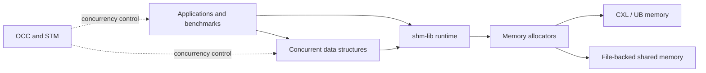

<div align="center">

# CXL-SDK

### A shared-memory systems toolkit for CXL and UB

[](LICENSE)
[](https://en.cppreference.com/w/cpp/17)
[](https://cmake.org/)
[](https://www.kernel.org/)

**Shared-memory runtime · Concurrent data structures · Memory allocators · Benchmarks and applications**

[Overview](#overview) · [Architecture](#architecture) · [Quick start](#quick-start) · [Components](#components) · [Documentation](#documentation)

</div>

---

## Overview

**CXL-SDK** is a C++ toolkit for developing and evaluating shared-memory systems on
[Compute Express Link (CXL)](https://computeexpresslink.org/) and Unified Buffer (UB)
memory. It brings together a shared-memory runtime, concurrent data structures,
pluggable allocators, concurrency-control mechanisms, and representative workloads
in one repository.

The SDK can target a CXL/UB-backed memory device or a file-backed shared-memory
region, making it useful for both hardware deployments and local development.

### Highlights

- **Shared-memory programming model** — memory mapping, non-temporal pointers,
  message queues, helper APIs, and multi-process coordination.
- **Concurrent data structures** — BwTree, Masstree, CLHT, ClevelHash, HOT,
  RadixART, BTree-OLC, and additional experimental structures.
- **Memory management** — memkind integration, `lsmalloc`, `cxlalloc`, and CXL
  shared-memory allocators.
- **Concurrency control** — optimistic concurrency control plus TinySTM, TL2,
  and SwissTM implementations.
- **Evaluation workloads** — YCSB-C, STAMP, correctness tests, microbenchmarks,
  and larger application ports.

> [!NOTE]
> CXL-SDK is an active systems-research project. Interfaces and configuration
> formats may evolve; validate workloads carefully before production use.

## Architecture



The main execution path is deliberately modular: applications select a data
structure, the data structure uses `shm-lib` for shared-memory services, and the
runtime delegates allocation to the configured backend.

## Components

| Area | Directory | What it contains |
| --- | --- | --- |
| Shared-memory runtime | [`shm-lib/`](shm-lib/) | Mapping, allocation APIs, message queues, connection management, and utilities |
| Data structures | [`ds/`](ds/) | Trees, tries, hash tables, locks, and persistent-memory variants |
| Allocators | [`malloc/`](malloc/) | `lsmalloc`, `cxlalloc`, and CXL shared-memory allocators |
| Concurrency control | [`stm/`](stm/) | TinySTM, TL2, and SwissTM |
| Benchmarks and tests | [`tests/`](tests/) | YCSB-C, allocator tests, basic tests, and correctness tests |
| Applications | [`apps/`](apps/) | STAMP and ports including DBx1000, Ditto, GeminiGraph, hnswlib, and more |
| Examples | [`demos/`](demos/) | Minimal single-process and multi-process data-structure examples |
| Documentation | [`website/`](website/) | Sphinx documentation in Chinese and English |

<details>
<summary><strong>Repository layout</strong></summary>

```text
shm-pcc-sdk/
├── apps/          # Applications and benchmark suites
├── demos/         # Small CXL-SDK usage examples
├── ds/            # Concurrent and persistent data structures
├── malloc/        # Shared-memory allocator implementations
├── shm-lib/       # Core shared-memory runtime library
├── stm/           # Software transactional memory implementations
├── tests/         # Benchmarks, unit tests, and correctness tests
└── website/       # Sphinx documentation sources
```

</details>

## Quick start

### Requirements

- Linux (Ubuntu 20.04 or newer is recommended)
- A compiler with C++17 support (GCC 7+ or Clang 10+)
- CMake 3.10+
- NUMA and memkind development libraries
- TBB for YCSB-C; libssh is optional and enables SSH-based multi-node setup

On Ubuntu or Debian:

```bash
sudo apt-get update
sudo apt-get install -y \
  build-essential cmake git \
  libnuma-dev libmemkind-dev libtbb-dev libssh-dev
```

### Build the core library

```bash
git clone git@github.com:promisivia/shm-pcc-sdk.git
cd shm-pcc-sdk

cmake -S shm-lib -B build/shm-lib
cmake --build build/shm-lib --parallel
```

To enable the Rust-based `cxlalloc` backend:

```bash
cmake -S shm-lib -B build/shm-lib-cxlalloc -DWITH_CXLALLOC=ON
cmake --build build/shm-lib-cxlalloc --parallel
```

### Run the data-structure demos

```bash
cd demos
./build.sh

./build/simple_demo
./build/simple_demo clevelhash
./build/multi_process_demo
```

See [`demos/README.md`](demos/README.md) for the API example and multi-process
usage notes.

### Run YCSB-C

```bash
cd tests/YCSB-C

# Build one or more variants; the last build becomes the ./ycsbc symlink.
./build.sh cc nocc

# Adjust the shared-memory device and size before running.
$EDITOR config.ini
./run_shm_ds.sh -db=bwtree -mode=test
```

Supported database adapters include:

| Adapter | Data structure |
| --- | --- |
| `bwtree` | BwTree |
| `masstree` | Masstree |
| `clht` | Cache-Line Hash Table |
| `clevelhash` | ClevelHash |
| `hot` | Height Optimized Trie |
| `btree_olc` | BTree with optimistic lock coupling |
| `radix_art_olc` | RadixART with optimistic lock coupling |

Common build variants are `cc`, `nocc`, `cc_mq`, `limit_atomic`, `lat_cc`, and
`lat_nocc`. Additional experiment-specific variants are declared in
[`tests/YCSB-C/CMakeLists.txt`](tests/YCSB-C/CMakeLists.txt).

## Configuration

YCSB-C reads its shared-memory setup from
[`tests/YCSB-C/config.ini`](tests/YCSB-C/config.ini). The most important fields
are:

```ini
[shm/cacheable]
mem_type=cxl
device_path=/dev/shm/cxl-$USER
mmap_base_addr=0xcaffe0000000
mem_size=32768
allocator_backend=memkind
```

| Setting | Purpose |
| --- | --- |
| `mem_type` | Selects the configured shared-memory type |
| `device_path` | CXL device or file-backed shared-memory path |
| `mmap_base_addr` | Requested virtual mapping base address |
| `mem_size` | Region size in MiB |
| `allocator_backend` | Lower allocator: `memkind` or `cxlalloc` |

For multi-process runs, all participants must use compatible mapping addresses,
region sizes, and shared-memory paths. The launcher may update ASLR settings and
create or resize the backing file, so review the script and required privileges
before running it.

## Documentation

| Resource | Description |
| --- | --- |
| [Documentation home](website/zh/docs/index.md) | Main Chinese documentation index |
| [Architecture](website/zh/docs/content/architecture.md) | Design and component relationships |
| [User guide](website/zh/docs/user-guide.md) | Installation, configuration, and usage |
| [Developer guide](website/zh/docs/developer-guide.md) | Repository and development workflow |
| [`shm-lib` API](website/zh/docs/api/shm-lib-api.md) | Runtime API overview |
| [English documentation](website/en/index.md) | English documentation entry point |

Build the documentation locally with:

```bash
cd website
python3 -m venv .venv
source .venv/bin/activate
pip install -r requirements.txt
make html
```

The generated site is written to `website/_build/html/`. For live preview, run
`website/serve.sh`.

## Testing and evaluation

The repository includes several levels of validation:

- [`tests/basic/`](tests/basic/) — low-level runtime and shared-memory tests
- [`tests/correctness/`](tests/correctness/) — data-structure correctness tests
- [`tests/allocator/`](tests/allocator/) — allocator-focused tests
- [`tests/YCSB-C/`](tests/YCSB-C/) — configurable key-value workloads
- [`apps/stamp/`](apps/stamp/) — transactional-memory application suite

Build and run each component from its own directory; several experiments have
hardware-, privilege-, or topology-specific requirements.

## Contributing

Contributions are welcome. Before opening a pull request:

1. Keep changes scoped and document any hardware assumptions.
2. Add or update the closest relevant test or benchmark.
3. Run the affected build and correctness checks.
4. Follow the [contributing guide](website/zh/docs/contributing.md).

Please report bugs and feature requests through
[GitHub Issues](https://github.com/promisivia/shm-pcc-sdk/issues).

## License and acknowledgements

CXL-SDK is released under the [MIT License](LICENSE). Individual third-party
components may carry their own licenses; consult the license files in their
respective directories before redistribution.

The repository incorporates or adapts work from projects including
[BwTree](https://github.com/wangziqi2013/BwTree),
[Masstree](https://github.com/kohler/masstree-beta),
[CLHT](https://github.com/LPD-EPFL/CLHT),
[HOT](https://github.com/speedskater/hot), and
[YCSB](https://github.com/brianfrankcooper/YCSB).

---

<div align="center">
Built for shared-memory systems research on emerging interconnects.
</div>
